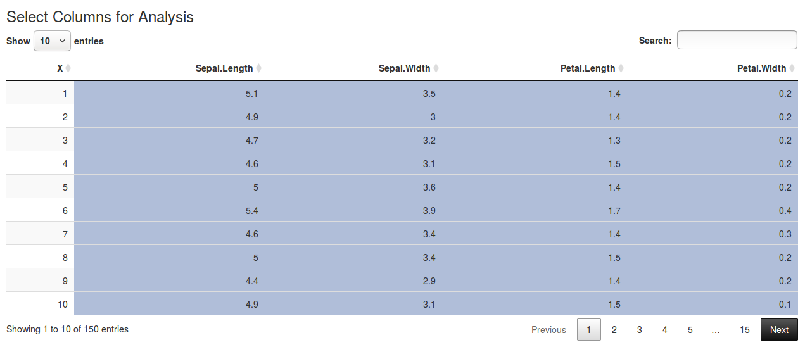
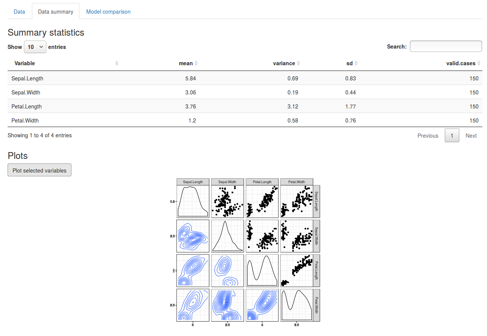
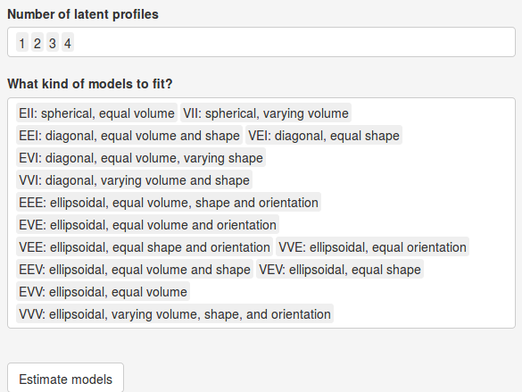
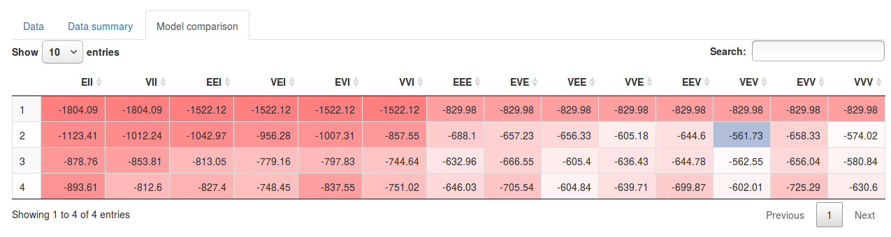
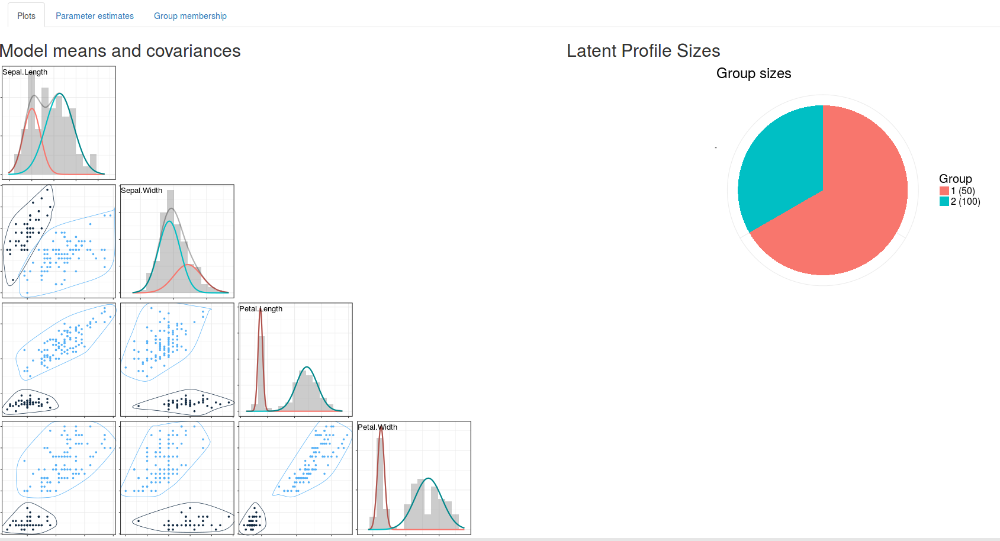
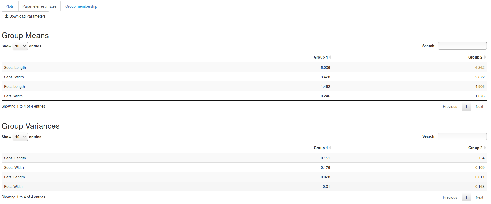
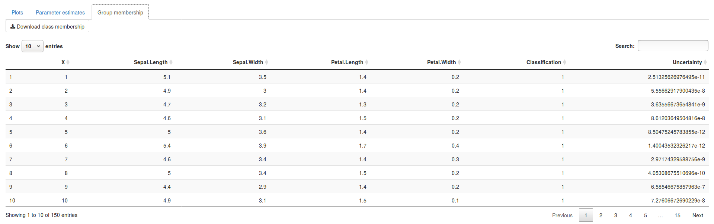

\newpage

LPAapp is a free Shiny app that can be used to perform latent profile analysis (LPA). The R package mclust [@scrucca_mclust_2016] runs under the hood to perform all analyses. First we describe how latent class analysis works; then we explain how to use the app. 

## Introduction to LPA

Latent Profile Analysis (LPA) is one of many mixture models, which are techniques for discovering underlying (latent) groups from data. By making specific assumptions about the distribution of the variables of the groups, they allow us to estimate how the groups look, and how many people belong to each group. Additionally, we can obtain the probability that a person belongs to a group, which enables group classification. Such models are useful in variety of situations, for example: 

 - We suspect that a new treatment has a positive effect on some patients, but not on others. We can fit a 2 group mixture model to the treatment result data, and see which variables (demographics, anamnesis, etc.) are characteristic of treatment success. We can then use this information to predict whether this treatment will be beneficial for a new patient.
 
 - We have data of some variables, but we are interested in others. @oberski_mixture_2016 for example shows how we can identify biological sex based on a body height.
 
 - We have a hypothesis regarding an inherently latent categorical structure. For example @dolan_fitting_1998 fit a mixture model to infer cognitive developmental stages of children using results on cognitive tasks.
 
LPA can be used when 1) the observed data are continuous and 2) we assume that the distribution of the variable(s) under each group follow a (multivariate) normal distribution. It is possible to conduct a mixture model on categorical data [commonly referred to as the Latent Class Analysis, @hagenaars_applied_2002] or assuming different distributions for each group.

Generally, the likelihood function of a mixture model is given as a weighted sum of individual densities of the latent components (groups):

$$
f(x|\pi, \theta) = \sum_k^G \pi_k f_k(x| \theta_k)
$$

where $G$ is the number of groups, $\pi$ is the proportion of the groups (mixing weights), $\theta$ the parameters of the assumed distribution of the groups; in case of LPA, we assume multivatiate normality for every group, and thus $\theta$ contains $\mu = (\mu_1, ..., \mu_G)$ mean vectors for each group and $\Sigma = (\Sigma_1, ..., \Sigma_G)$ the variance-covariance matrices for every group. The subscripts for model parameters indicate the parameter sets for a particular group $k$. 

If we knew which people belonged to which group, all we would need to do is split the data by group and compute group means and variance-covariance matrices. Estimating the proportions of the groups would just require counting how many people are in each group. However, because we do not know which people belong to which group, we need to estimate this as well!

Estimating in which group a person belongs is also easy if we know the proportions of the groups, and means and variance-covariance structure within each group. By applying a Bayes theorem, the probability that a person $i$ with a set of observations $x_i$ is belonging to a group $k$ is:

$$
P(G = k| x_i) = \frac{P(G =k) P(x_i|\theta_k)}{P(x_i|\theta)} = \frac{\pi_k \times f_k(x_i| \mu_k, \Sigma_k)}{\sum_j^G \pi_j f_j(x_i| \mu_j, \Sigma_j)}
$$

However, now we face the problem that we do not know the model parameters, nor the group memberships. Luckily, the Expectation-Maximization algorithm [@dempster_maximum_1977, see also @do_what_2008] is able to both estimate the model parameters and the group membership probabilities by applying two steps sequentially:

We begin with a random guess of the model parameters (proportions, means and variance-covariances). Using those

1) We compute the probabilities of group membership for every person in the dataset using the current model parameters. (Expectation)

2) Using the probabilities from 1) as weights, we compute the model parameters. (Maximization)

We repeat this until the parameters do not change anymore. Usually, the optimization is ended when the likelihood of the model does not change. The likelihood, here, is a product of the likelihoods of all observations under the model:

$$
f(x_1, x_2, ..., x_n|\pi, \theta) = \prod_i^n\sum_k^G \pi_k f_k(x_i| \mu_k, \Sigma_k)
$$

Alternatively, we can start with a random guess of the group membership probabilities. In that case we first do step 2),then 1), and repeat; this is also called a Maximization-Expectation algorithm. It has been shown that this procedure is guaranteed to increase the likelihood of the model until a local optimum is reached [@dempster_maximum_1977]. Finding a global optimum is considerably harder - especially if the model is complex - but this is out of scope of this report.

So far, we have described how the LPA works, but we have not discussed how to identify the number of latent groups. To fit an LPA model, we need to make an a-priori decision about the number of groups we want to estimate. This is considerably easier when we have a strong theory or we know how many groups there are. A standard practice is to fit models with different numbers of groups and conduct a model comparison to select the "best model" [@fraley_how_1998]. In this app, we rely on the Bayesian Information Criterion (BIC) for model comparison and selection. It should be stressed that in practice, one should take into account more than just a BIC when assessing the models - especially because BIC cannot tell us whether we are comparing only very bad models with each other!

### Modeling with mclust

LPA can be performed in a variety of ways; the mclust package estimates the mean structure and the group proportions freely, while it offers a way to constrain the model by assumptions about the variance-covariance structure between variables across groups. The models are generated by eigenvalue decomposition of the variance-covariance structure [@banfield_model-based_1993] $\Sigma_k = \lambda_kD_kA_kD_k^T$ into *volume*, *shape* and *orientation*:

#### Volume

The *volume* parameter $\lambda$ determines whether groups are allowed to have a differing multivariate volume; that is, whether they are forced to have equal eigenvectors. When one group is expected to contain a larger range of responses than another group, it is recommended that volume be allowed to vary.

#### Shape

The *shape* parameter $A$ determines whether groups are allowed to be just spherical, or also diagonal or ellipsoid, and whether the different groups are allowed to have different shapes. When shape is set to be an identity matrix, all groups are assumed to be spherical - variables within groups are forced have multivariate independence.
When it is set to be equal across groups, all groups will have equal shape (ratios of eigenvectors). The clusters may be larger or smaller, depending on whether volume is allowed to vary. When the shape parameter is allowed to vary, one group may be spherical (all eigenvectors are identical) and another may be diagonal (eigenvectors are different, but not tilted; there is no covariance) or spherical (when Orientation is not set to be an identity matrix).

 
#### Orientation
The *orientation* parameter $D$ determines whether the multivariate shape of the groups, that is, the eigenvectors, must be oriented in the same direction. In a two-variable example, when Orientation is set to be an identity matrix, all eigenvectors are perpendicular to the axis and no covariance can occur within groups. When orientation is set to be equal across groups, the eigenvectors of all groups are allowed to be tilted, but they must all be tilted in the same direction; differences are not allowed between groups in within-group variable covariance. When orientation is allowed to vary, one group may display a positive correlation between variables while another group displays a negative correlation between those variables.

By imposing constraints on the parameters across groups, we can group the implied densities into three families [@erar_mixture_2011]:

#### Spherical family distribution
The spherical family of models constraints variables to have identical and untilted eigenvectors in each group; therefore, these models are the most parsimonious and restrictive.

#### Diagonal family distribution
The diagonal family of models constrains all groups to have untilted eigenvectors, but allows them to differ per variable; each variable has its own variance. This allows modelling variables with differing ranges, but variables are still assumed to be uncorrelated within groups (covariances are still set to zero within groups; the covariance matrices are diagonal). 

#### Ellipsoidal family distribution
The ellipsoidal family distribution does not restrict the variance-covariance matrices to be diagonal, and thus takes into account the complete covariance structure of the data. These models are the most complicated to estimate and are the most unstable.

### Other options for latent profile models

It is important to note that this parametrization based on the eigenvalue decomposition of the covariance matrix, developed by @banfield_model-based_1993, is by far not the only one. Another approach is to use structural equation decomposition $\Sigma_k = \Lambda_k(I - B_k)^{-1}\Psi_k(I - B_k)^{-1T}\Lambda_k^T + \Theta_k$, which allows us to formulate latent multi-group SEM analysis with the option of modelling the mean structure [@vermunt_structural_2014]. @dolan_fitting_1998 for example build a model of a developmental change of ability to conserve continuous quantity (an ability that is formed in the concrete operational stage according to Piaget). The justification for this model is that the cognitive development stages are supposed to be qualitative - transitioning to a concrete operational stage could change the covariance structure between several volume conservation items, which can be revealed in a latent variable (SEM) model. It is difficult to identify which children are and which are not in the operational stage, before seeing the data; it thus has to be estimated. Latent profile mixture SEM makes this possible.

This option is not available in the app, however, as it runs on package mclust, which does not use SEM parameterization of the variance-covariance matrix.

## Introduction to LPAapp

LPAapp can be started by running the following line of code: 
`shiny::runGitHub("spiritspeak/LPAapp")
`

The application is divided in two sections (and an about section), see Figure 1. In the first section, the user can load data and select data for the analysis, specify the models to be estimated, and compare the models. In the second section, the user can see the results of the selected model.

### Environment

Under the `Data tab` of `Model Settings`, the user can load their own data, or simply use the built-in and commonly used dataset iris [@anderson_irises_1935] to try out the app. The user must select the different `model types` and different `numbers of groups` they want to fit on the data. The different `model types` involve constraints regarding variable variances and covariances between groups - they are explained in the app under the `Need some help?` button and further discussed in the mclust manual [@scrucca_mclust_2016]. Additionally, the variables of the dataset are displayed and the user can select which variables they want to use in the LPA (all variables are used by default). `Estimate models` must be clicked in order to obtain results. Under the `Data Summary` tab, statistics per variable can be viewed. The user can plot a matrix with scatterplots in the lower triangle and density contour plots in the upper triangle in this tab as well. If models have been estimated, the user can view Bayesian Information Criterion (BIC) values for all successfully fitted models in a group number - by model-type matrix table under the `Model Comparison tab`. Also displayed here is a line graph showing the evolution of BIC score per model type as the number of groups is increased. In the `BIC table`, the user selects which model they would like to view the results for. By default, the best model is selected; however, the user can select any model they would like to examine.

Under the `Plots tab` of `Results`, the user can view a scatterplot matrix for each combination of two variables, with group memberships highlighted. On the diagonal, marginal distributions per group are plotted over histograms of each variable. Additionally a pie chart is displayed featuring group sizes. 

Under the `Parameter Estimates` tab, model group means and variances can be viewed, and model parameters can be downloaded as `.Rdata` file. 

Under the `Class membership` tab, group membership for each case can be viewed, along with the classification uncertainty per case. This can give us a hint about whether a case is a typical member of a group, or could have belonged to a different group instead.  Additionally, the dataset can be downloaded with group membership and uncertainty of classification as additional columns.

### Example

Here we will perform a latent profile analysis on the default dataset provided in the app, iris. 
We select the four relevant columns for our analysis: `Sepal.Length`, `Sepal.Width`, `Petal.Length`, `Petal.Width`. We skip the `X` column, which contains the case id as can be seen in Figure 2.

We then have a look at the scatterplot matrices under the `Data Summary` tab to get a hint about how many groups there may be, see Figure 3. 

On first sight, it looks like there are 2 clusters in the data. We select group numbers 1 to 4, and all estimable model types, to be compared using the Bayesian Information Criterion. See Figure 4 for a picture how to set up the models. 

We view the BIC table to select our final model; we go with the best, which has been preselected, see Figure 5. This ellipsoidal model features 2 groups and equal shape for both groups.

We then head over to the `Results` tab to view plots for the results, see Figure 6. 

The clustering analysis seems to fit the data well. We view the group means and variances under `Parameter estimates`.

And lastly, we download the dataset with group memberships (note: Downloading files from Shiny apps works only if the app is run from an external browser - viewing the app in a window or a pane in R Studio will cause the app to crash.).

We hope you enjoy our app and find its features appealing! 

\newpage

## References
